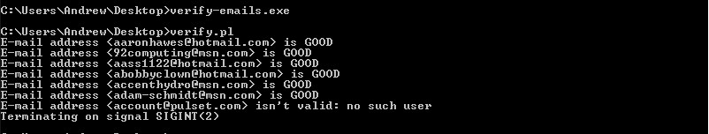

# free bulk email verify
This code is written in perl language | Used on website  https://everify.ricomart.com/ 

How to run this code ?
First you need to have a software called as strawberry perl which you can download from https://strawberryperl.com/
Download as per your OS

Then you need to install some support files for the above script to work

Just open your terminal and fire the below commands

cpan install File::Find 
cpan install File::Basename 
cpan install Parallel::ForkManager  
cpan install List::Util  
cpan install Mail::CheckUser  

All all the support files are installed now you are good to run the give code with the below given command 

perl verify.pl

Make sure you keep all your email under a file called putemail.txt and all the good email will be paste to new file called good_Email.txt

More info on the above code can be found under
https://blog.ricomart.com/everything-you-need-to-know-about-bulk-email-verification/

